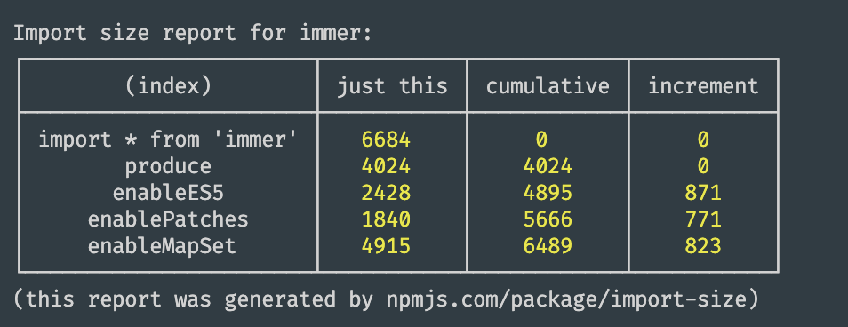

# import-size

Measure the real, minified, tree-shaken impact of individual imports into your app

<a href="https://www.buymeacoffee.com/mweststrate" target="_blank"></a>

# Usage

`npx import-size <dependency> <imports>`. For example: 

`npx import-size immer produce enablePatches`

`npx import-size --report immer produce enableES5 enablePatches enableMapSet`




If you want to generate reports as part of your tooling, you might want to `import-size` as development dependency using `yarn` or `npm`.

# Why

This tool is basically the result of a long-winded twitter [thread](https://twitter.com/mweststrate/status/1228056670447730688). 
A long story short: this tool will calculate how many bytes a dependency costs, after bundling it for production and apply-ing treeshaking, based on the things you actually want to import.

`import-size` fixes that and comes as a convenient CLI tool. It wraps the excellent [import-cost](https://github.com/wix/import-cost/tree/master/packages/import-cost) package (also available as VS Code [plugin](https://marketplace.visualstudio.com/items?itemName=wix.vscode-import-cost)). This tool will create a mini project, that imports precisely the requested imports using production tree-shaking settings. 

This is not only useful to monitor your app's size budget, but also when you are maintaining a library. Especially in "report" mode, see below

## Examples

```bash
$ npx import-size mobx autorun observable computed action
13337
```
Using only `autorun`, `observable`, `computed` and `action` from "MobX" will result in 13 KB (gzipped) being added to your bundle


```bash
$ npx import-size mobx '*'
15850
```
Importing the full MobX api will take 2KB more (so clearly it is not super good at tree-shaking (yet!))

You can also point the tool at any local directory that contains a module source. 
For example, running `npx import-size . autorun` in the MobX directory will measure the size of `autorun` in the directory in which you run this command. 
(Do make sure that the library has been build locally in the latter case) 

To measure the size of a default export, just pass in `default` as method name.

To measure the size of all exports, pass in `*`. To prevent bash expanding this into a bunch of file names, you will typically have to quote it like: `'*'`.

The sizes displayed are gzipped and include transitive dependencies (regardless whether these deps are shared with other libs). Sizes are always a few (~20) bytes off due to utility code that is injected.

## Report mode

Report mode can break down the costs of a library as you import more and more of it's features:

```bash
$ import-size --report immer produce enableES5 enablePatches enableMapSet

Import size report for immer:
┌────────────────────────┬───────────┬────────────┬───────────┐
│        (index)         │ just this │ cumulative │ increment │
├────────────────────────┼───────────┼────────────┼───────────┤
│ import * from <module> │   6684    │     0      │     0     │
│        produce         │   4024    │    4024    │     0     │
│       enableES5        │   2428    │    4895    │    871    │
│     enablePatches      │   1840    │    5666    │    771    │
│      enableMapSet      │   4915    │    6489    │    823    │
└────────────────────────┴───────────┴────────────┴───────────┘
(this report was generated by npmjs.com/package/import-size)
```

The report mode first reports the cost of doing a 'side effect import' and a `'*'` (everything) import.

The rows after that show the import sizes of all mentioned imports:
1) individually in the first column
2) combined with the above rows
3) the delta of that

So the above report shows that just importing `enablePatches` from 'immer' will cost you `1840` bytes. But, it will cost only an additional `871` bytes if you are already importing `produce` and `enableES5` anyway. In other words, if you just use `produce` from Immer it will arrive at 4KB, and the three additional opt-in features will all come at roughly 1 additional KB (note that those numbers are not accurate for Immer, they are just a demonstration).

Also note that the order of arguments does matter for the cumulatives and increment columns, so you typically want to put the imports in an order that make sense to future library users. Reports like these might be useful in documentation.
